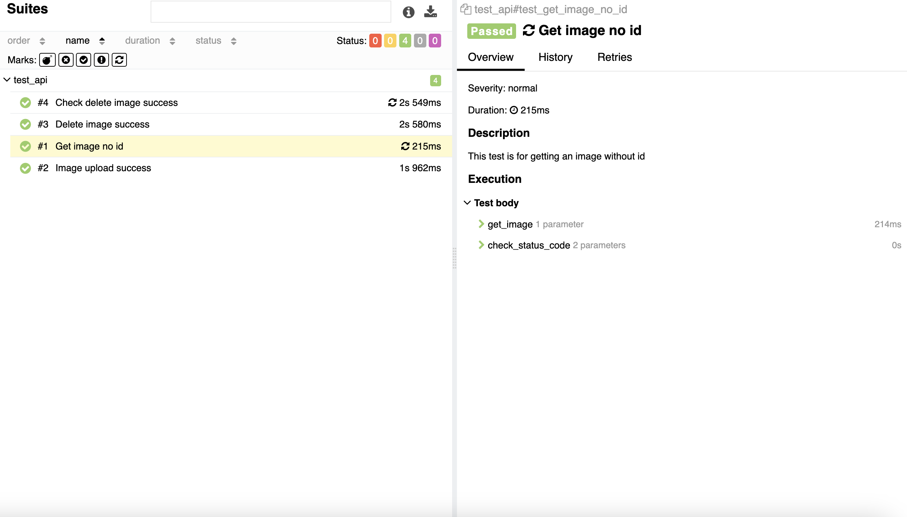
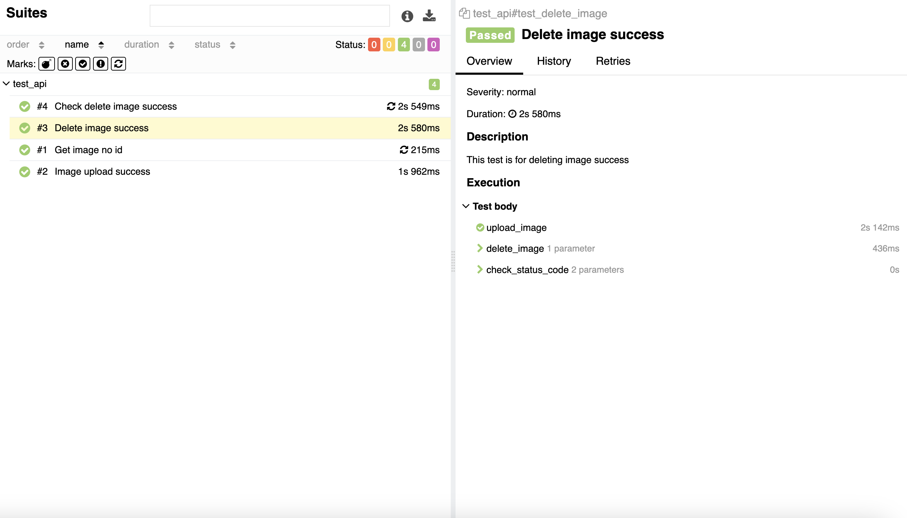
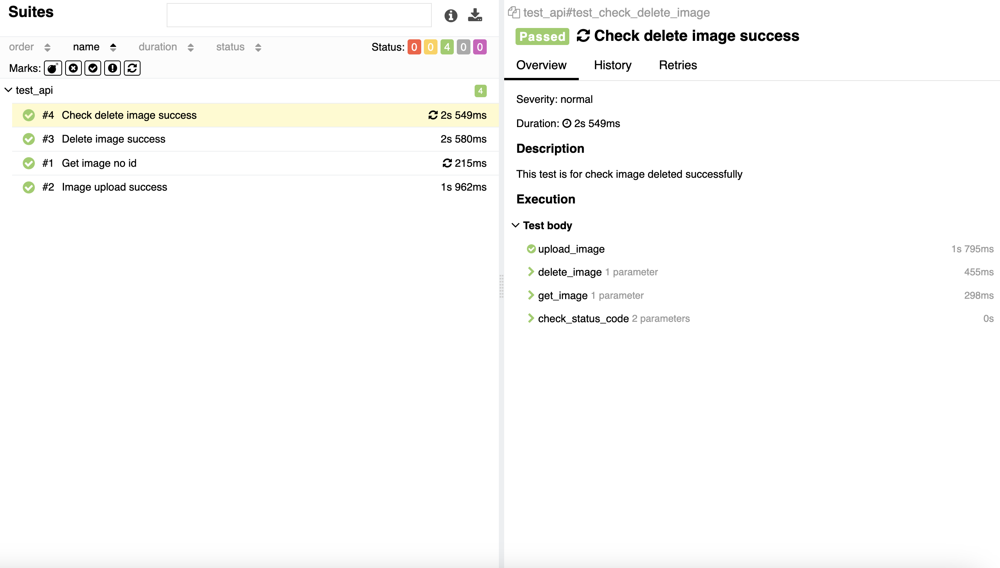

# RestAPI_test

## Test Cases

| **#** | **Title**                                   | **Description**                                               | **Test Steps**                                                                                   | **Expected Result**                  |
|-------|---------------------------------------------|---------------------------------------------------------------|--------------------------------------------------------------------------------------------------|---------------------------------------|
| 1     | Test Search an Image Without ID             | This test is for getting an image without providing an ID     | 1. Send a GET request without an image ID 2. Verify the response status code is 400         | Should return an HTTP 400 error     |
| 2     | Test Image Upload                           | This test is for uploading an image successfully             | 1. Send a POST request to upload the image 2. Verify the response status code is 201        | Should return an HTTP 201 status code |
| 3     | Test Delete Image                           | This test is for successfully deleting an image              | 1. Send a POST request to upload the image 2. Send a DELETE request to delete the image using the image ID 3. Verify the response status code is 204 | Should return an HTTP 204 status code |
| 4     | Test Check Delete Image Success             | This test is for checking that an image has been successfully deleted | 1. Send a POST request to upload the image 2. Send a DELETE request to delete the image using the image ID 3. Send a GET request using the same image ID 4. Verify the response status code is 400 | Should return an HTTP 400 error     |

---

