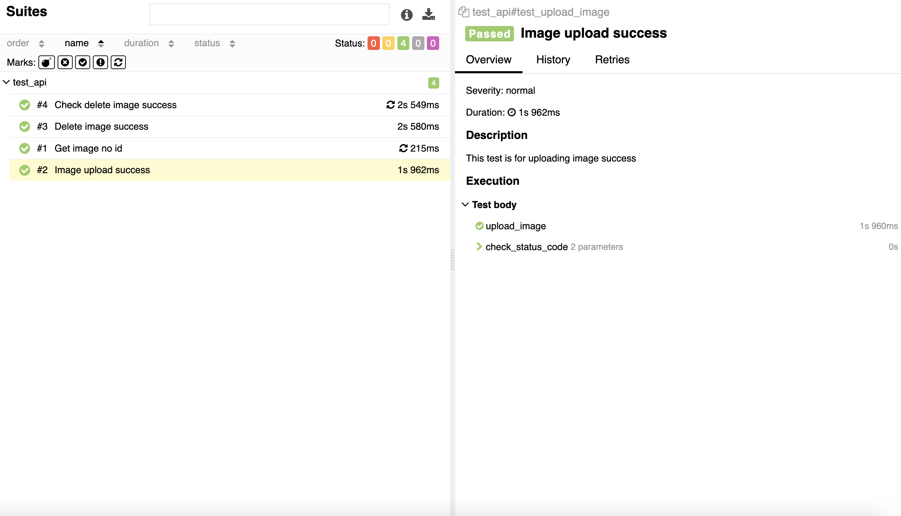

# RestAPI_test

### Test Case 1: Test Search an Image Without ID
- **Description**: This test is for getting an image without providing an ID.  
- **Test Steps**:  
  1. Send a GET request without an image ID.  
  2. Verify the response status code is 400.  
- **Expected Result**: Should return an HTTP 400 error.  

### Test Case 2: Test Image Upload
- **Description**: This test is for uploading an image successfully.  
- **Test Steps**:  
  1. Send a POST request to upload the image.  
  2. Verify the response status code is 201.  
- **Expected Result**: Should return an HTTP 201 status code.  

### Test Case 3: Test Delete Image
- **Description**: This test is for successfully deleting an image.  
- **Test Steps**:  
  1. Send a POST request to upload the image.  
  2. Send a DELETE request to delete the image using the image ID.  
  3. Verify the response status code is 204.  
- **Expected Result**: Should return an HTTP 204 status code.  

### Test Case 4: Test Check Delete Image Success
- **Description**: This test is for checking that an image has been successfully deleted.  
- **Test Steps**:  
  1. Send a POST request to upload the image.  
  2. Send a DELETE request to delete the image using the image ID.  
  3. Send a GET request using the same image ID.  
  4. Verify the response status code is 400.  
- **Expected Result**: Should return an HTTP 400 error.

---

